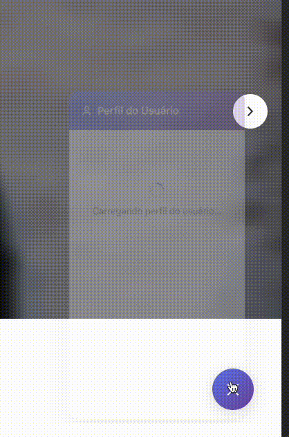
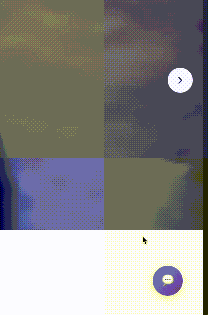
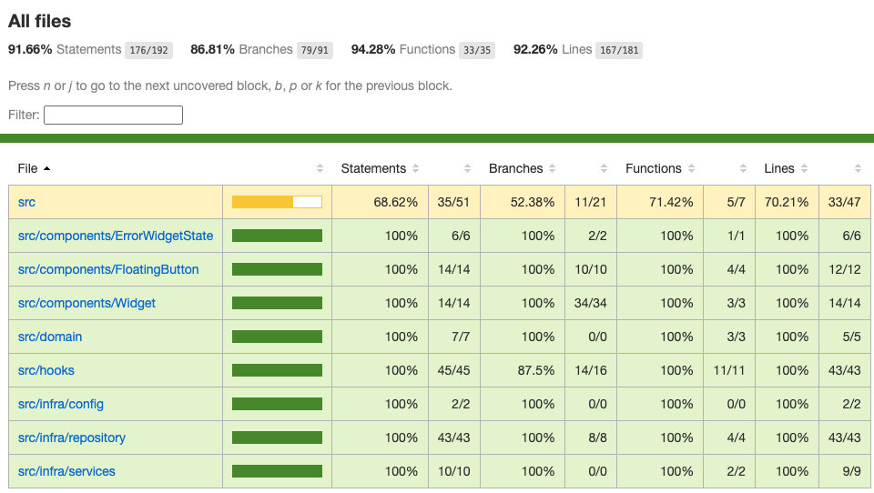

# Projeto Widget React

## Visão Geral

O projeto foi desenvolvido e entregue com um widget completo, composto por:

- **Aplicação React**
  - Botão flutuante de abertura/fechamento do widget
  - Janela de informações do usuário e seus posts
- **Script **``
  - Responsável pelo carregamento da aplicação na página do cliente

Diferentemente das instruções iniciais, o botão foi implementado dentro da aplicação React, garantindo:

- Maior controle de estilos e comportamentos
- Tratamento de estados de abertura e fechamento
- Melhor integridade do código, considerando que o script externo não é facilmente atualizado

O projeto foi construído utilizando uma arquitetura robusta, visando demonstrar um case sólido de implementação.

## Arquitetura e Estrutura

A arquitetura segue um padrão inspirado em DDD (Domain-Driven Design), com separação clara de responsabilidades:

- **Infraestrutura (**``**)**: Serviços, repositórios e configuração de acesso à API
- **Domínio (**``**)**: Objetos de domínio (`User` e `Post`) e regras de negócio
- **Adapters e Hooks**: Abstraem a lógica de fetch para os componentes, permitindo expansão futura
- **Components**: Renderização e interação da interface do usuário
- **Main (**``**)**: Exporta o componente React final

O fluxo arquitetural segue de fora para dentro:\
`INFRA → Service → Repository → DOMAIN → Adapters → Hooks → COMPONENTS → main.tsx`

### Estrutura de pastas do projeto

```
react-app
├── src
│   ├── assets
│   ├── components
│   │   └── Widget
│   │       ├── index.tsx
│   │       └── styles.ts
│   ├── domain
│   │   └── user.ts
│   ├── hooks
│   │   └── useWidgetVisibility.ts
│   ├── infra
│   │   ├── config
│   │   │   └── apiInstance.ts
│   │   ├── repository
│   │   │   └── user.ts
│   │   └── services
│   │       └── user.ts
│   ├── main.tsx
│   ├── vite-env.d.ts
│   └── window.d.ts
├── tests
```

### Tecnologias e padrões

- **Axios** para requisições HTTP
- **Variáveis de ambiente** para segurança
- **Tratamento de erros** completo em todas as etapas:
  - Busca do `userId` na página pai do iFrame
  - Requisições à API de usuário e posts
  - Retry individual para falhas
- **Smooth Opening** com delay para prevenir falhas de renderização da página pai
- **Loadings independentes** para cada requisição, garantindo boa experiência de usuário

## Funcionalidades do Widget

- Abertura/fechamento do widget com botão flutuante
- Exibição de informações do usuário: nome e e-mail
- Listagem de posts do usuário: título e conteúdo
- Smooth Opening

- Loadings

- Refetch automático dos posts a cada abertura do widget, preservando o estado do usuário

- Tratamento de erros pra chamadas do User | Com retry

- Tratamento de erros pra chamadas dos Posts | Com retry

- Testes de fluxo simulando alterações na API (ex.: usando proxy de rede)


## Testes Unitários

O projeto conta com testes unitários completos utilizando Jest e React Testing Library, seguindo a mesma organização do código para manter clareza e facilidade de manutenção.

### Estrutura dos testes

```
tests/
├── components/           # Testes dos componentes React
│   ├── ErrorWidgetState/
│   ├── FloatingButton/
│   └── Widget/
├── hooks/                # Testes dos hooks customizados
├── domain/               # Testes da camada de domínio
├── infra/                # Testes da camada de infraestrutura
│   ├── repository/       # Testes dos repositórios
│   ├── services/         # Testes dos serviços
│   └── config/           # Testes das configurações
├── setup.ts              # Configuração global dos testes
└── README.md             # Este arquivo
```

### Como executar os testes

Executar todos os testes:

```bash
npm test
```
Executar testes e conferir o coverage:

```bash
npm run test:coverage
```

### Cobertura



**Os testes abrangem:**

- Renderização de componentes
- Lógica de negócio
- Tratamento de erros
- Estados de loading
- Validações
- Adapters

